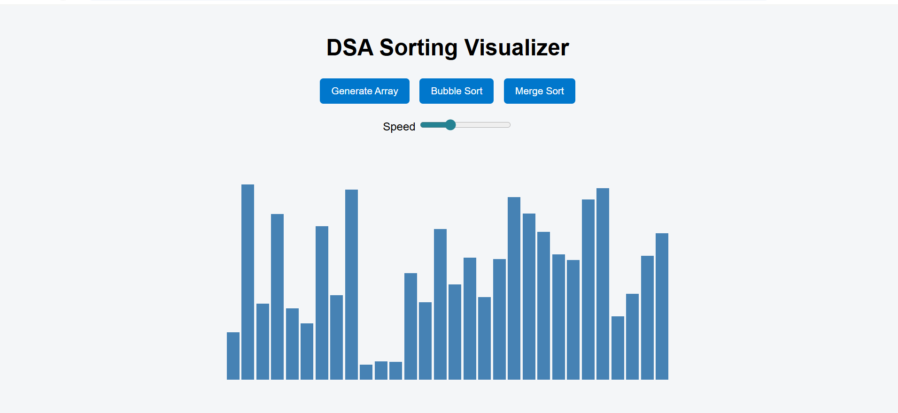
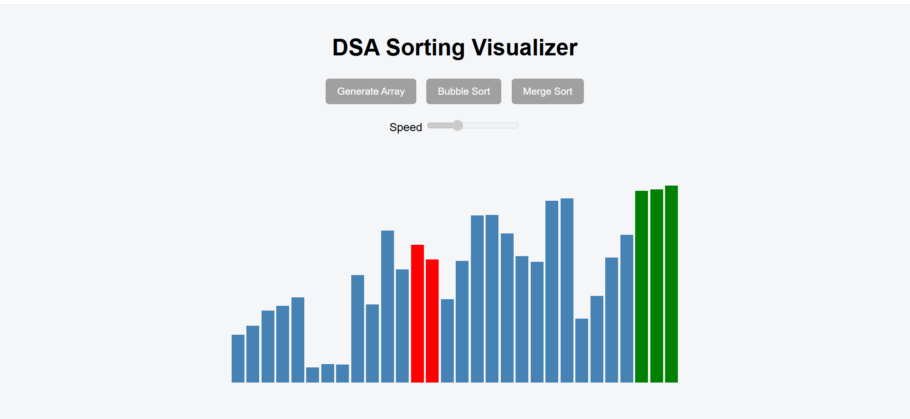
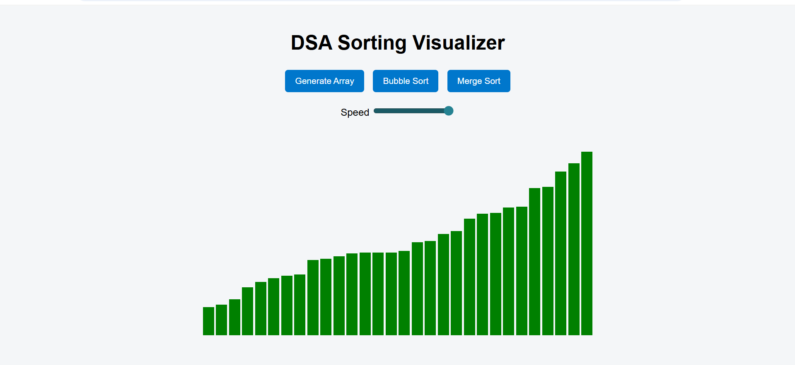

# DSA Sorting Visualizer

This project is a web-based tool designed to visually demonstrate how common sorting algorithms work internally.  
Instead of treating algorithms as black boxes, the visualizer shows comparisons, swaps, and intermediate states step by step.

The project was built to strengthen conceptual understanding of Data Structures and Algorithms through visualization.

---

## Features

- Visual representation of sorting algorithms using bars
- Step-by-step animation of comparisons and swaps
- Adjustable animation speed
- Clear visual distinction between unsorted, comparing, and sorted elements
- Simple and clean user interface

---

## Algorithms Implemented

- Bubble Sort  
  Time Complexity: O(n²)

- Merge Sort  
  Time Complexity: O(n log n)

---

## Project Preview

Initial random array before sorting  


Bubble sort in progress with comparisons highlighted  


Final sorted array after completion  


---

## Tech Stack

- HTML for structure
- CSS (Flexbox) for layout and styling
- JavaScript for logic, animations, and DOM manipulation

---

## Concepts Covered

- Data Structures and Algorithms
- DOM manipulation
- Asynchronous JavaScript using async/await
- Algorithm visualization techniques
- UI state handling during long-running operations

---

## How to Run the Project

1. Clone the repository:
   ```bash
   git clone https://github.com/yasaswiyendluri/DSA-Sorting-Visualizer.git
2.Open the project folder and run index.html using Live Server or directly in a browser.